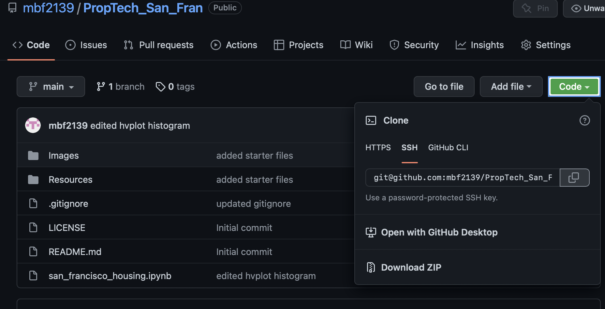
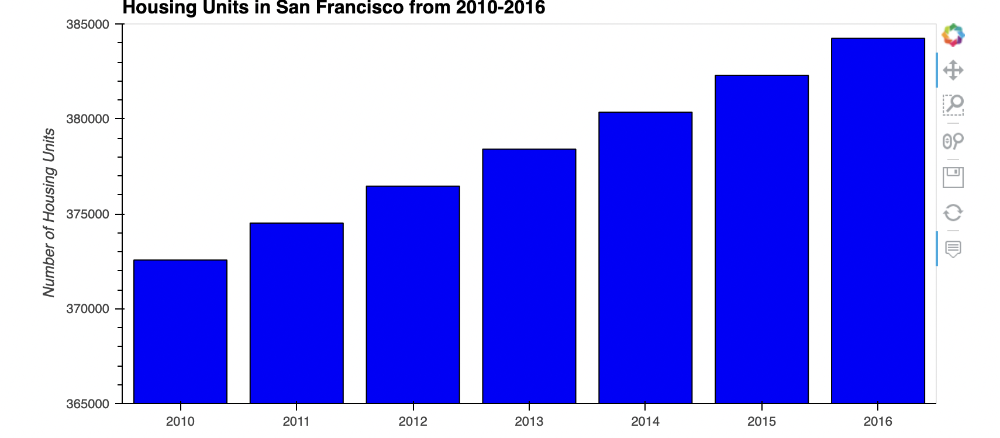
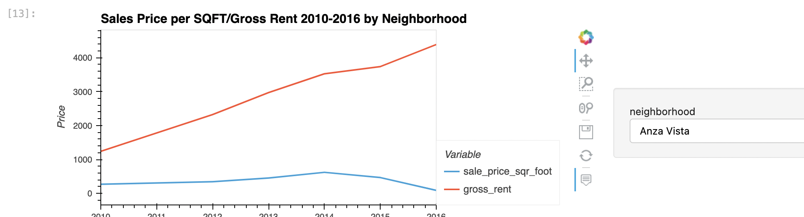
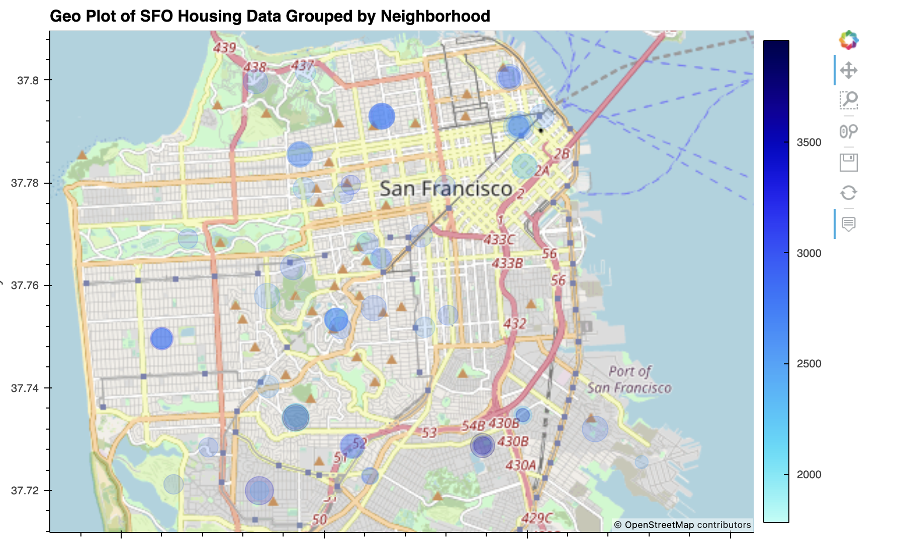

# San Francisco Housing Analyis 2010-2016

## SF, CA Housing Analysis using HVPlot and APIs
---
## Technologies

This analysis leverages Python 3.7 with the following technologies:
* [pandas](https://github.com/pandas-dev/pandas) - For data analysis and manipulation.
* [pyviz hvplot](https://github.com/pyviz/pyviz.org) - For interactive data visualizations 
* [pathlib](https://github.com/jazzband/pathlib2) - For file manipulation
---
## Installation 

1. Clone the repo 

2. Before running the program make sure to install the following dependencies:

            '''
            python
            pip install pathlib
            conda install -c pyviz hvplot geoviews
            '''
3. Data is contained in the ***Resources*** folder and intercangeable with data of user's choice 
--- 
## Usage 

1. To run the analysis navigate to ***san_francisco_housing.ipynb*** file within the PropTech_San_Fran repo

2. The program will return a series of interactive data visualizations that analyze San Francisco's housing/rental market over a period of 6 years 2010-2016 

3. The first is a histogram that shows the growth in total available housing units within the timeframe 

4. The second groups the data by neighborhood a seperately tracks sales and rental prices

5. The third visualizes the mean sales/rental prices during the timeframe and plots the data onto a map of the city, the size of each plot point representing sales prices and color representing rental prices

---

## Contributors

The starter code was contributed by the [FinTech Bootcamp at Columbia Engineering](https://bootcamp.cvn.columbia.edu/fintech/)

Matthew Field finalized the application, his work is availble to view on [Github](https://github.com/mbf2139)

---

## License

MIT